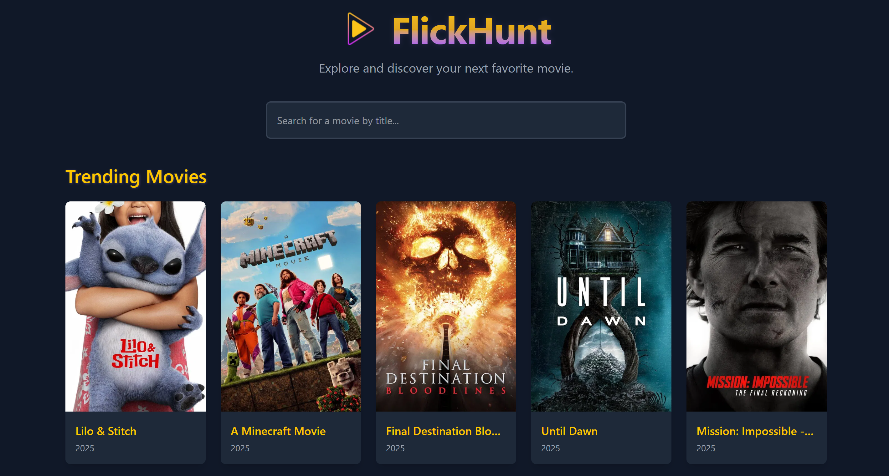

# 🎬 FlickHunt – Movie Explorer

**FlickHunt** is a sleek and responsive React-based web app that lets you search for movies using the [TMDB API]. Designed for speed, simplicity, and a smooth user experience, FlickHunt allows you to explore movies with detailed information in just a few clicks.

---

## 🚀 Features

- 🔍 Real-time movie search using TMDB API
- 📄 Detailed movie view (plot, genre, rating, etc.)
- 📱 Fully responsive & mobile-friendly layout
- ⚡ Built with React, React Router, and Tailwind CSS
- 🧠 Clean and minimal UI for a smooth user experience

---

## 🖼️ Preview

---

## 🛠️ Tech Stack

- **React** – Frontend framework
- **React Router DOM** – Client-side routing
- **Tailwind CSS** – Utility-first CSS for styling
- **TMDB API** – Movie data source

---

## Folder Structure

src/
├── components/
│   ├── MovieCard.jsx
│   └── Search.jsx
├── pages/
│   ├── Home.jsx
│   └── MovieDetail.jsx
├── App.js
└── index.js

