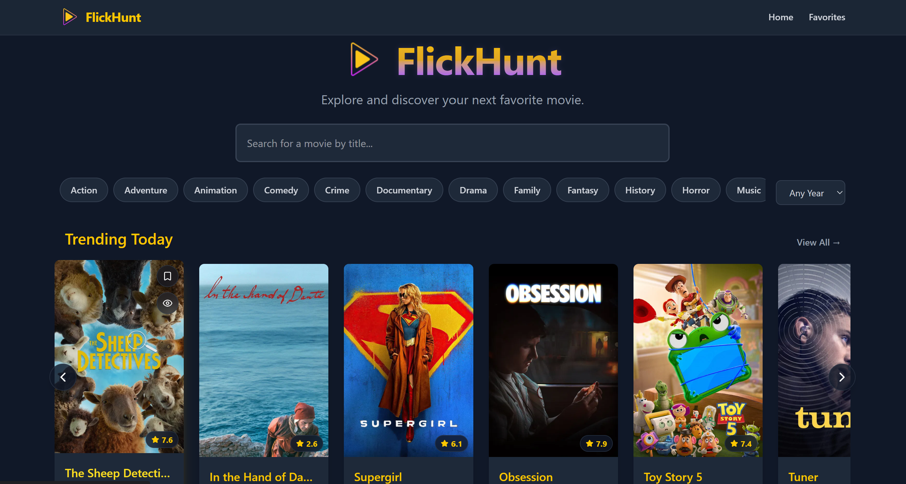

# 🎬 FlickHunt – Movie Explorer

**FlickHunt** is a sleek and responsive React-based web app that lets you search, discover, and track movies using the [TMDB API](https://www.themoviedb.org/documentation/api). Built for speed, simplicity, and a smooth user experience — find your next favorite film in just a few clicks.

---

## 🚀 Features

- 🔍 **Real-time movie search** with debounced input and clear button
- 📄 **Detailed movie view** — plot, genre, rating, director, cast, language, and more
- 🎬 **Trailer playback** — watch the official YouTube trailer directly in-app
- 🔖 **Favorites** — bookmark movies and access them anytime, no login required
- 👁️ **Watchlist** — mark movies as watched and track what you've seen
- 📊 **Trending categories** — Trending Today, Top Rated, and Upcoming sections on the home page
- 🎞️ **Similar movies** — "You Might Also Like" row on every detail page
- ⭐ **Rating badges** — TMDB score overlaid on every movie poster
- 🔗 **IMDb link** — direct link to the movie's IMDb page from the detail view
- 📱 **Fully responsive** — works across all screen sizes
- ⚡ **Smooth page transitions** powered by Framer Motion

---

## 🖼️ Preview

---

## 🛠️ Tech Stack

- **React** – Frontend framework
- **React Router DOM** – Client-side routing
- **Tailwind CSS** – Utility-first styling
- **Framer Motion** – Page transition animations
- **Lucide React** – Icon library
- **TMDB API** – Movie data source
- **localStorage** – Persistent favorites and watchlist (no backend required)
